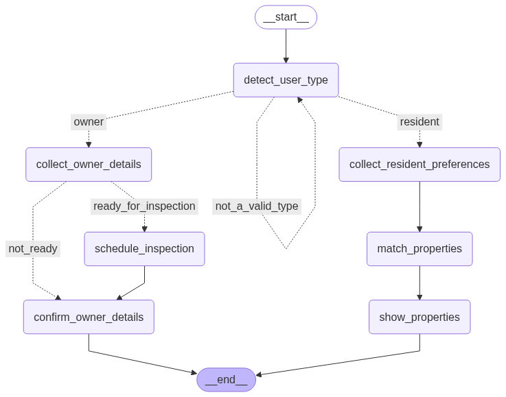

# Realest Tate Agent

This is a Python+LangGraph agent example with CLI human interaction (without interrupts).

It implements a flow with multiple conditions as a workflow. It does not use a swarm with a supervisor, since the steps are well-defined beforehand.

